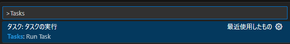
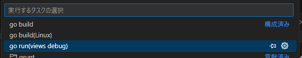
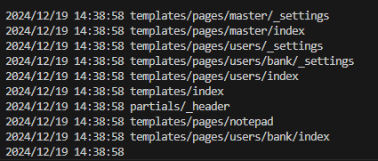
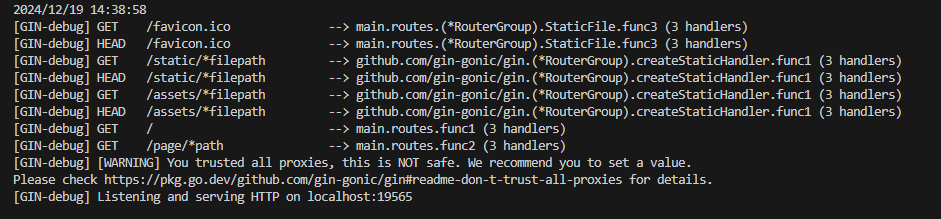

# Web system architecture

## About


## 必要な環境

- **Node.js** v20.17以上

## 【推奨】 Node.jsのバージョン管理

- fnmを使用したバージョン管理
- VoltaによるNode.jsのバージョン管理ができる場合はそちらを使用

[fnm (Fast Node Manager) のインストール方法と使い方](https://qiita.com/taqumo/items/b25d486e6ead9f38a13d)

## 【推奨】pnpmによるパッケージ管理

> pnpm がインストールされていない場合は、以下のコマンドでインストール可能:
> ```bash
> npm install -g pnpm
> ```

## セットアップ方法

### 1. リポジトリをクローン

```bash
git clone git@github.com:yamatoku-kawamoto/web-system-architecture.git
cd web-system-architecture
```

### 2.依存関係をインストール

viewディレクトリで実行する

```bash
pnpm install
```

### 3.開発サーバーを起動

viewディレクトリで実行する

```bash
pnpm dev
```

ローカルサーバーが起動し、以下のURLでアクセスできるようになる:
```
http://localhost:5173
```

### 4.ビルド

viewディレクトリで実行する

次のコマンドを実行することで、本番環境向けビルドを作成する:
```bash
pnpm build
```

ビルドされたファイルは dist/ ディレクトリに出力される。

### 5.Go言語のテンプレート機能を試す


goのインストール確認
```bash
go -v
```

Ctrl+Pでコマンドパレットを開き、タスクを実行する。



vscodeのタスクで**go run(views debug)**を実行する。






